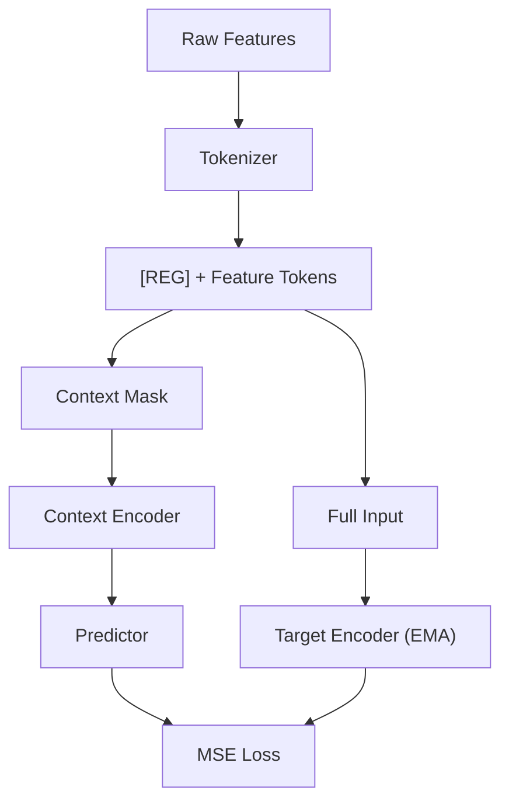

# T-JEPA

Augmentation-free self-supervised learning for tabular data.

T-JEPA adapts the Joint Embedding Predictive Architecture to tabular datasets. It learns representations by masking subsets of features and predicting their embeddings through an EMA-updated target encoder — no data augmentation required.

## How It Works



1. **Tokenizer** converts numerical (linear projection) and categorical (embedding lookup) features into tokens, prepending a learnable `[REG]` token
2. **Context encoder** processes a random masked subset of features (~14-37%)
3. **Target encoder** (EMA copy, no gradient) processes the full input
4. **Predictor** takes context embeddings + learnable mask tokens and predicts target embeddings for held-out features (~16-62%)
5. **MSE loss** between predictions and stop-gradient targets drives learning

## Setup

```bash
conda env create -f environment.yml
conda activate tjepa
```

Requires Python 3.12+ and PyTorch 2.4+.

## Usage

### Pretraining

```bash
# California Housing (numerical only, regression)
python scripts/train.py --dataset california --epochs 100 --batch-size 512

# Adult Income (mixed numerical + categorical, classification)
python scripts/train.py --dataset adult --epochs 100
```

Checkpoints and training history are saved per dataset to `checkpoints/{dataset}/`:

```
checkpoints/
  california/
    best.pt
    last.pt
    training_history.csv
  adult/
    best.pt
    last.pt
    training_history.csv
```

Training uses early stopping with patience=15.

### Evaluation

Evaluate learned representations with a linear MLP probe on the downstream task:

```bash
# Auto-resolves to checkpoints/{dataset}/best.pt
python scripts/evaluate.py --dataset california

# Or specify checkpoint explicitly
python scripts/evaluate.py --checkpoint checkpoints/adult/best.pt --dataset adult
```

Reports R² for regression tasks and accuracy for classification tasks.

## Project Structure

```
scripts/
  train.py              # Pretraining CLI
  evaluate.py           # Downstream evaluation CLI
src/
  tjepa.py              # TJEPA model (context encoder, target encoder, predictor)
  encoder.py            # Transformer encoder
  predictor.py          # Transformer predictor
  tokenizer.py          # Feature tokenization (numerical + categorical)
  mask.py               # MaskCollator for context/target splits
  trainer.py            # Training loop with schedulers and early stopping
  checkpoint.py         # Save/load checkpoints
  scheduler.py          # LR, weight decay, and EMA momentum schedules
  config.py             # Hierarchical dataclass configuration
  data/
    base.py             # Abstract TabularDataset
    california.py       # California Housing dataset
    adult.py            # Adult Income dataset
    preprocessing.py    # StandardScaler, LabelEncoder, Dataset wrappers
  evaluation/
    extraction.py       # Feature extraction from frozen target encoder
    downstream.py       # MLP probe training and evaluation
tests/                  # Unit and integration tests
```

## Supported Datasets

| Dataset | Features | Task |
|---------|----------|------|
| California Housing | 8 numerical | Regression |
| Adult Income | 6 numerical + 8 categorical | Binary classification |

## Testing

```bash
pytest tests/ -v
```
